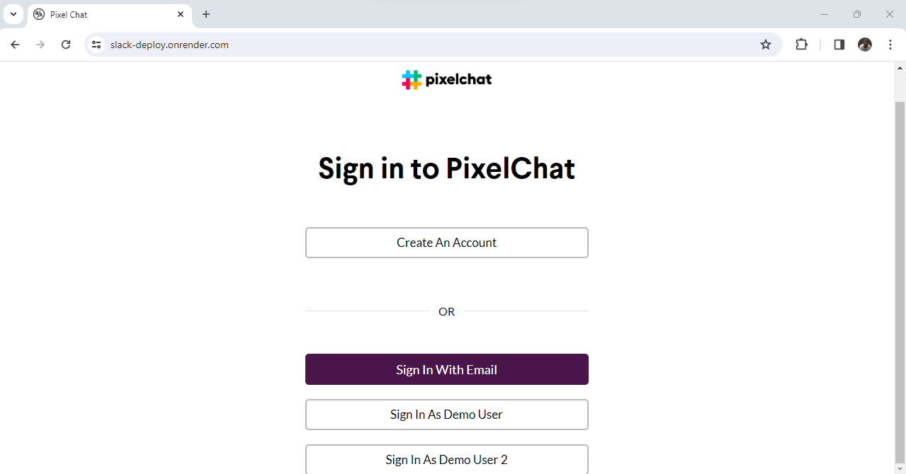
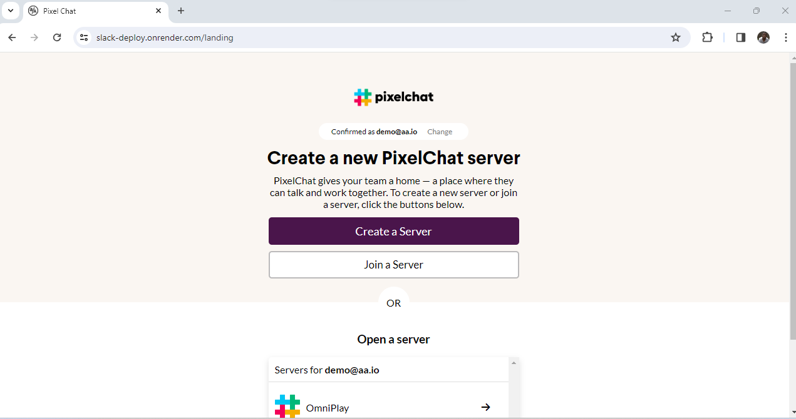
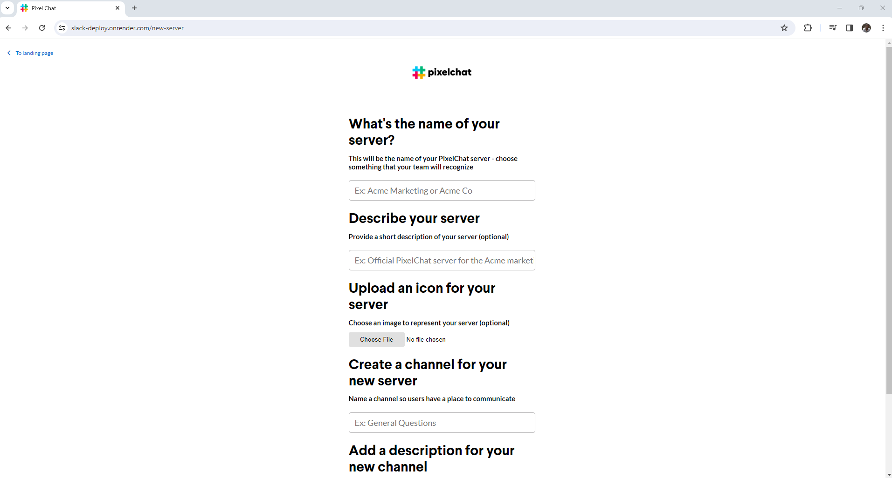
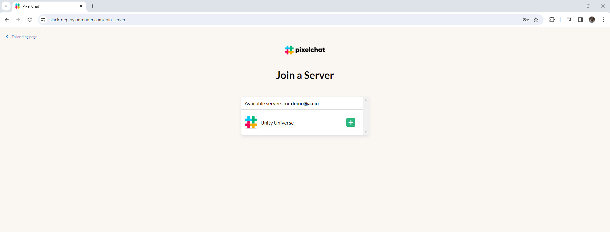
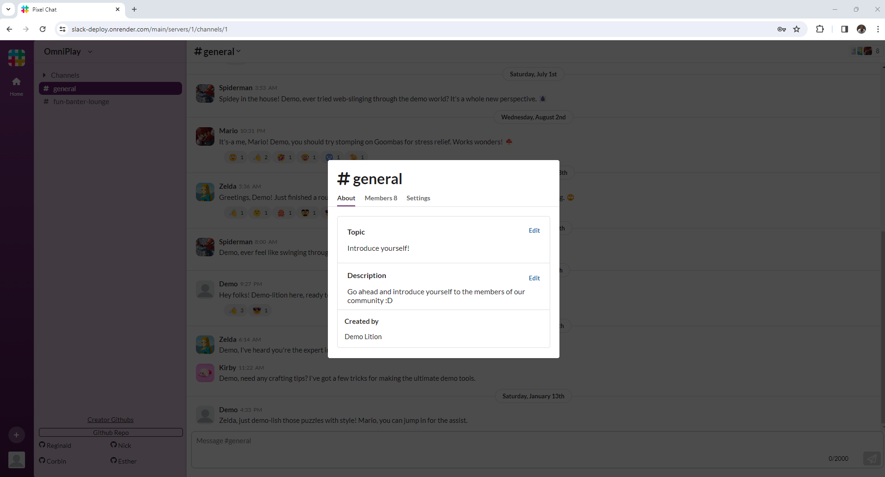
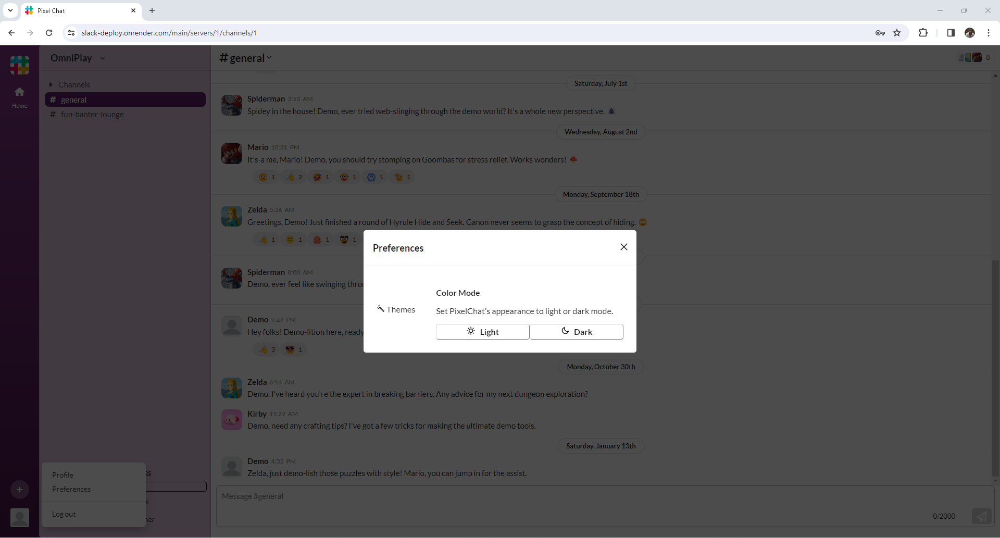
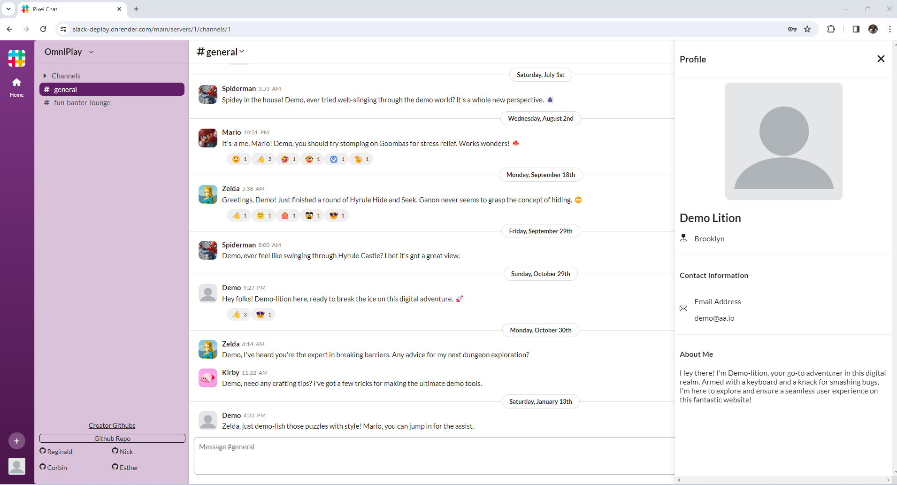
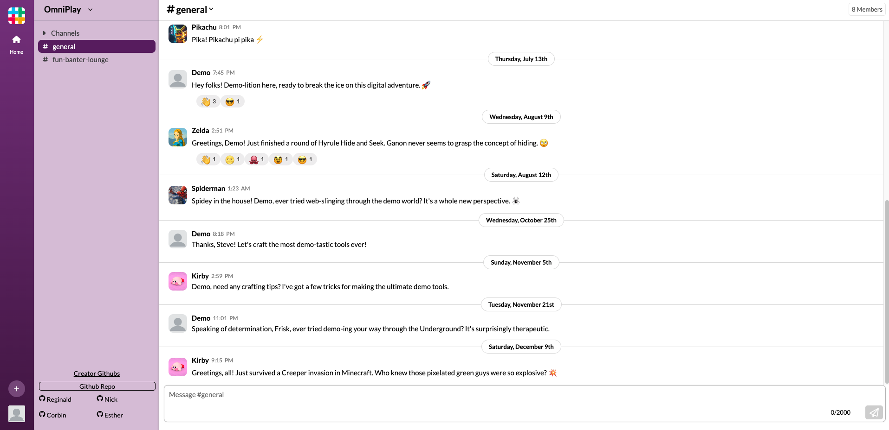

#  PixelChat

PixelChat is a website clone of [Slack](https://www.slack.com/) populated with content inspired by famous video game characters like Mario, Minecraft Steve, Kirby, and Zelda. PixelChat allows users to create and join unique servers and channels designed to host fun conversations between server members. To help express themselves, users can customize their profile and add emoji reactions to any message they like! [Click here to view the PixelChat Live Site](https://slack-deploy.onrender.com/)

## 🌐 Wiki Link

* [Database Schema](https://github.com/Promingy/SlackProject/wiki/Slack-Clone-DB-Schema)
* [Feature List](https://github.com/Promingy/SlackProject/wiki/Feature-list)
* [User Stories](https://github.com/Promingy/SlackProject/wiki/User-Stories)
* [API Routes](https://github.com/Promingy/SlackProject/wiki/API-routes)
* [Frontend Routes](https://github.com/Promingy/SlackProject/wiki/Frontend-routes)
* [React Components List](https://github.com/Promingy/SlackProject/wiki/React-Components-list)

## 💻 Languages and Technologies

This is a concise list of what was utilized to develop this project.

<div>
   
   
   &nbsp;
   &nbsp;
   &nbsp;
   &nbsp;
   &nbsp;
   &nbsp;
   &nbsp;
   
   
</div>

## ⚙️ Getting started

1. Clone this repository (only the main branch).

2. Install dependencies.

   ```bash
   pipenv install -r requirements.txt
   ```

   to regenerate requirements.txt run `pipenv requirements > requirements.txt`

3. Create a __.env__ file based on the example with proper settings for your
   development environment.

4. Make sure the SQLite3 database connection URL is in the __.env__ file.

5. Make sure the AWS S3 credentials (bucket name, S3 key, and S3 secret key) are in the __.env__ file. If you don't have an AWS S3 bucket set up:
   1. Set up an account on [AWS](https://aws.amazon.com/)
   2. Create a new S3 bucket for your application (to store your files)
   3. Create a user to access the S3 bucket (this user has the necessary credentials) If you accidentally expose these credentials, you should delete the user's credentials and create new credentials.

6. Install the Boto3 package to help integrate AWS uploads in to your Flask/React applications

7. This starter organizes all tables inside the `flask_schema` schema, defined
   by the `SCHEMA` environment variable.  Replace the value for
   `SCHEMA` with a unique name, **making sure you use the snake_case
   convention.**

8. Get into your pipenv, migrate your database, seed your database, and run your
   Flask app:

   ```bash
   pipenv shell
   ```

   ```bash
   flask db upgrade
   ```

   ```bash
   flask seed all
   ```

   ```bash
   flask run
   ```

9. To run the React frontend in development, `cd` into the __react-vite__
   directory and run `npm i` to install dependencies. Next, run `npm run build`
   to create the `dist` folder. The starter has modified the `npm run build`
   command to include the `--watch` flag. This flag will rebuild the __dist__
   folder whenever you change your code, keeping the production version up to
   date. Finally, run `npm run dev` to open the application on the local browser.

## 📷 Landing Page:

You will be able to test the features without sign up by clicking on one of the "Demo User" buttons in the Signup Page. You will then be directed to the landing page, where you can create a server, join a server, or open a server.











## ⚠️ Technical implementation details

* Websockets
  * We set up on the backend a websocket listener that listens for server, join messages, and leave messages. When somebody joins a server on the server page, they are subscribed to the room (i.e. server) listener. Any message sent from them or anyone else that has joined that room is broadcasted to everyone else that has joined this room.
   ```
   from flask_socketio import SocketIO, emit, join_room, leave_room
   import os

   if os.environ.get("FLASK_ENV") == "production":
      origins = "https://slack-deploy.onrender.com"
   else:
      origins = "*"

   socketio = SocketIO(cors_allowed_origins=origins)

   @socketio.on("server")
   def handle_socket(data):
      room = data["room"]
      # print("~~~~~", data)
      emit("server", data, room=room)

   @socketio.on("join")
   def handle_join(data):
      # print("------", data)
      room = data["room"]
      join_room(room)
      emit("server", data['user'], room=room)

   @socketio.on("leave")
   def handle_leave(data):
      # print("*******", data)
      room = data["room"]
      leave_room(room)

   ```
  * Any time anyone performs a CRUD action in a server (for reactions, channels, messages, and/or servers), we dispatch a thunk to the backend database, then emit a message saying what we just did, and finally everyone (including the actor that initiated this CRUD) will receive this message and update their frontend redux store accordingly - message reception code parses through the type of message and the action, and using any data attached to the message will update the local state of everyone who received the message.
    ```
    # react-vite/src/components/MessageBox/MessageBox.jsx

    const sendSocket = (message) => {
        socket.emit("server", message)
    }

    function handleSubmit(e) {
        e.preventDefault()

        const newMessage = {
            body: message,
            pinned: false
        }
        setMessage('')

        dispatch(initializeMessage(channelId, newMessage))
            .then(res => {
                const messageToEmit = {
                    userId: res.user_id,
                    type: 'message',
                    method: "POST",
                    room: +serverId,
                    channelId,
                    message: res
                }

                sendSocket(messageToEmit)

                const element = document.querySelector('.all-messages-container')
                element.scrollTo(0, element.scrollHeight)
            })


    }
    ```
* AWS
  * In the backend, we set up a file with helper functions that uses environmental variables to connect to the AWS S3 Bucket and exports functions to delete from and upload images to that bucket.
  ```
   # app/aws.py

   import boto3
   import botocore
   import os
   import uuid

   ALLOWED_EXTENSIONS = {"png", "jpg", "jpeg", "gif", "svg"}
   BUCKET_NAME = os.environ.get("S3_BUCKET")
   S3_LOCATION = f"http://{BUCKET_NAME}.s3.amazonaws.com/"

   s3 = boto3.client(
      "s3",
      aws_access_key_id=os.environ.get("S3_KEY"),
      aws_secret_access_key=os.environ.get("S3_SECRET"),
      region_name="us-west-1"
   )

   def get_unique_filename(filename):
      ext = filename.rsplit(".", 1)[1].lower()
      unique_filename = uuid.uuid4().hex
      return f"{unique_filename}.{ext}"

   def upload_file_to_s3(file, acl="public-read"):
      try:
         s3.upload_fileobj(
               file,
               BUCKET_NAME,
               file.filename,
               ExtraArgs={
                "ACL": acl,
                "ContentType": file.content_type
            }
        )
      except Exception as e:
         # in case the our s3 upload fails
         return {"errors": str(e)}

    return {"url": f"{S3_LOCATION}{file.filename}"}

   def remove_file_from_s3(image_url):
      # AWS needs the image file name, not the URL,
      # so we split that out of the URL
      key = image_url.rsplit("/", 1)[1]
      try:
         s3.delete_object(
         Bucket=BUCKET_NAME,
         Key=key
        )
      except Exception as e:
         return { "errors": str(e) }
      return True


  ```
  * In our user creation, server creation, and server deletion routes, we call these helper functions when appropriate
     * Note: one issue we ran into was passing the server image url from the frontend component into the backend route. We attempted to pass the image url into the backend route as a url parameter. However, the backend route did not recognize it as a url parameter because it was itself a url. We resolved this issue by refactoring our delete server backend route so that the server image url is directly queried using the id of the server we were trying to delete.
   ```
   # app/api/server_routes.py

   @server.route("images", methods=["POST"])
   def upload_image():
    form = ImageForm()
    form['csrf_token'].data = request.cookies['csrf_token']
    if form.validate_on_submit():

        image = form.data["image"]
        image.filename = get_unique_filename(image.filename)
        upload = upload_file_to_s3(image)
        # print(upload)

        if "url" not in upload:
        # if the dictionary doesn't have a url key
        # it means that there was an error when we tried to upload
        # so we send back that error message (and we printed it above)
            return {"errors":[upload]}, 401

        url = upload["url"]
        return {"url": url}

    if form.errors:
        # print(form.errors)
        return {"errors": form.errors}, 401

   @server.route('/<int:serverId>', methods=['DELETE'])
   @login_required
   def delete_server(serverId):
      server = Server.query.get(serverId)
      if server and int(session['_user_id']) == server.to_dict()['owner_id']:
         remove_file_from_s3(server.image_url)
         db.session.delete(server)
         db.session.commit()
         return {'message': 'Successfully deleted'}
      return {'errors': {'message': 'Unauthorized'}}, 403
   ```
* Themes
  * We set up two themes (light mode and dark mode) with several colors stored as variables for each theme. We then stored these themes in the browser's local storage, which allowed us to proceed without having to create an extra table in our database. Any time a user set the theme or refreshed their page, the colors of each element of the diplayed component would dynamically change based on whether the document's theme was set to light or dark.

  ```
   # react-vite/src/components/ChannelCreationForm/ChannelCreationForm.jsx

   useEffect(() => {
     const storedTheme = localStorage.getItem("theme");
     if (storedTheme) {
       setTheme(storedTheme);
     }
   }, []);
  ```

  ```
  # react-vite/src/components/ChannelPage/ChannelPage.css

  .theme-light {
  --color-background: white;
  --color-font: #1d1c1d;
  --color-hover: #f6f6f6;
  --inner-nav-header-hover: #c9aecb;
  --inner-nav-hover: #c7acc8;
  --channel-header-hover: #f6f6f6;
  --inner-nav-channel-font: #454447;
  --inner-nav-wrapper-border: #c0aec4;
   }

  .theme-dark {
  --color-background: #1b1d21;
  --color-font: #d0d1d2;
  --color-hover: #424242;
  --inner-nav-header-hover: #562c56;
  --inner-nav-hover: #562c56;
  --channel-header-hover: #353739;
  --inner-nav-channel-font: #b9babe;
  --inner-nav-wrapper-border: #747474;
   }
  ```
* Slideout menu
  * We set up a user-friendly interface to be able to view other people's profiles
    * Note: in our initial attempt to implement this feature, we realized that hotswitching CSS classes does not automatically trigger the animation we wanted to implement. In order to resolve this, we refactored our code so that the handleProfileModal function simultaneously disables and enables state variables that assign class names to the ProfileModal in order to properly trigger the sliding animation.
  ```
   # react-vite/src/components/ChannelPage/MessageTile.jsx

   function handleProfileModal(e) {
        e.preventDefault()
        const profile = document.getElementsByClassName('profile-modal')
        const xBtn = document.getElementsByClassName('close-profile')
        let node = e.target

        for (let i = 0; i <= 6; i++) {
            if (node === profile[0] ||
                e.target.src === user?.image_url && +e.target.id === +message.id ||
                +e.target.id === +message.id) return

            else if (node === xBtn[0]) break

            else node = node.parentNode

        }
        setProfileModal2(true)

        setProfileModal(false)
        setTimeout(() => setProfileModal2(false), 350)
        window.removeEventListener('mousedown', handleProfileModal)
    }

    return (
        <>
            {profileModal &&
                <div className='profile-modal-messages'>
                    <ProfileModal animation={false} userId={message.user_id} />
                </div>
            }
            {profileModal2 &&
                <div className='profile-modal-messages'>
                    <ProfileModal animation={true} userId={message.user_id} />
                </div>
            }
            < REST OF CODE>
         <>
    )
  ```

## ⏩ Future Features
* Huddles
* Direct Messages
* Threads
* Search
